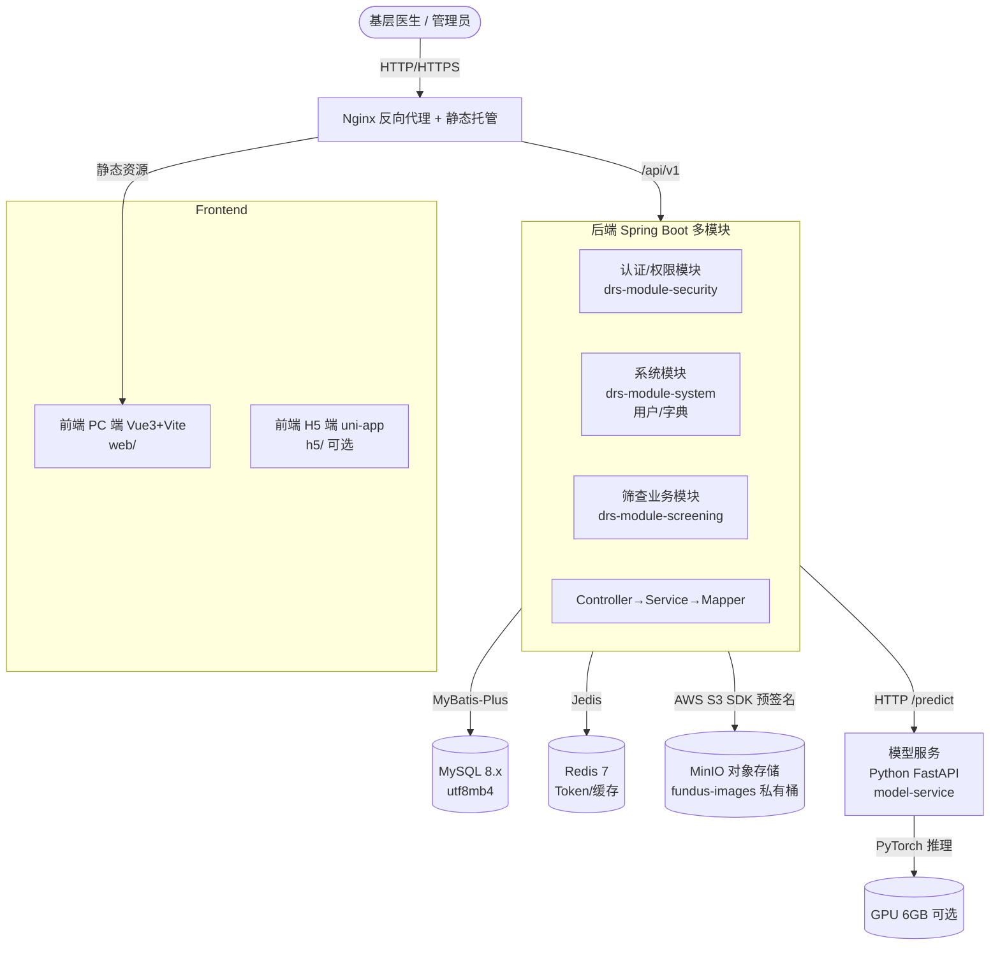
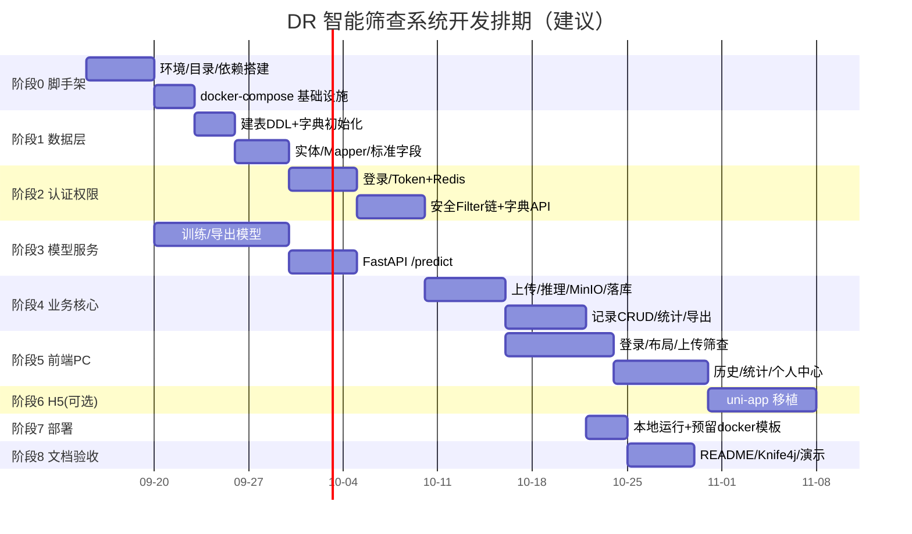

# 糖尿病视网膜病变（DR）智能筛查系统 — 项目开发计划

> 版本：v1.1（决策冻结版）
> 编制日期：2026-09-09
> 编制依据：`docs/糖尿病视网膜病变（DR）智能筛查系统 — 项目综述文档.md` + `spec/` 全套开发规范
> 文档定位：整体项目规划与开发排期，指导后续编码、联调与交付。

---

## 一、文档目的与依据

本文档在综述文档（需求侧）与 `spec/`（约束侧）之间建立落地桥梁，明确：

1. 工程结构、技术栈严格对齐 `spec/`，消除综述与规范之间的表述冲突；
2. 数据库、接口、权限、模型服务的具体设计方案；
3. 分阶段开发计划、里程碑与验收标准；
4. 待决策事项的处理建议。

**规范效力说明**：依 `spec/project/项目规则.md`，`spec/` 效力高于综述文档。两者冲突时以 `spec/` 为准，冲突点见[第十五章](#十五与综述文档的冲突消解)。

---

## 二、待决策事项（需项目确认）

规范修订报告已列出 5 项待确认事项。规划给出**推荐采用方案**，请项目方确认：

经分批确认，原待决策项已冻结，另补充 3 项设计确认（字典编码 / 导出格式 / 部署形态）。下表为最终决策清单：

| # | 事项 | 决策 | 依据 |
| --- | --- | --- | --- |
| 1 | 认证方式 | **UUID Token + Redis**（`X-Access-Token`，Session 模式） | spec 自定义 Filter 链；已确认替代综述 JWT |
| 2 | 响应体字段 | **`{code, msg, data}`** | spec 已统一，已确认 |
| 3 | 项目前缀 `{app}` | **`drs`** | 已确认 |
| 4 | Java 根包 | **`cn.edu.fzu.drs`**（模块包 `cn.edu.fzu.drs.module.*`） | 已确认（用户提供域名反写） |
| 5 | 前端 PC 包管理器 | **Yarn** | spec 指定，已确认 |
| 6 | 权限模型 | **轻量化角色映射**（角色→权限静态映射 + 数据权限 SELF/ALL，不建 RBAC 表） | 仅 2 角色，已确认 |
| 7 | H5 移动端 | **本期仅做 PC 端**，uni-app H5 留作后续可选 | 已确认 |
| 8 | 模型可解释性 | **Grad-CAM 热力图本期实现**（pytorch-grad-cam，前端叠加展示） | 已确认 |
| 9 | 字典项编码 | **字符型**（DOCTOR/ADMIN、LEVEL_0..LEVEL_4、REVIEW/CLINIC/REFERRAL） | 已确认（可读性优先） |
| 10 | 模型训练资源 | **NVIDIA RTX 4050 6GB（笔记本）**，混合精度；CPU 推理作降级兜底 | 已确认 |
| 11 | 导出格式 | **仅 Excel**（结构化明细） | 已确认（取消 PDF） |
| 12 | 部署形态 | **本期纯本地开发运行**；`deploy/` 保留 docker-compose.yml + Dockerfile 模板作**预留**，不强制容器化交付 | 已确认 |

> 决策已冻结，后续进入阶段 0 实施。Redis Session 模式已确认，无需再修订 AuthFilter 为 JWT 验签；部署本期聚焦本地可运行，容器化作为预留能力。

---

## 三、总体架构

### 3.1 架构图



### 3.2 分层与依赖

- 前端（PC/H5）→ 后端 REST API（`/api/v1`）。
- 后端 → MySQL（业务数据）、Redis（会话/缓存）、MinIO（图像，经预签名 URL）、模型服务（HTTP 推理）。
- 模型服务**独立部署、可水平扩展**，后端通过 HTTP 调用，需对模型服务不可用做降级（返回 503 + 友好提示）。
- 不暴露 MinIO 公网地址；图像访问由后端生成预签名 URL（有效期 7 天）返回前端。

---

## 四、技术栈对齐（与 `spec/design/项目技术栈.md` 一致）

| 层 | 选型 | 关键约束 |
| --- | --- | --- |
| 后端 | JDK 21 / Spring Boot 3.x / MyBatis-Plus / Knife4j | RESTful、`{code,msg,data}`、Swagger 中文 |
| 缓存 | Redis 协议，Java 用 Jedis | 会话 Token、统计数据缓存 |
| 对象存储 | S3 协议（MinIO），AWS S3 SDK | 私有桶 + 预签名 URL |
| 安全 | 自定义 Filter 链（不引入 Spring Security） | 见[第九章](#九权限设计) |
| 前端 PC | Vue3 + TS + Vite6 + Element Plus + Pinia + ECharts | Yarn、ESLint/Prettier/Stylelint |
| 前端 H5 | uni-app(Vue3) + TS（可选阶段） | 一套代码编译 H5/小程序 |
| 模型服务 | Python 3.12 + FastAPI + PyTorch | `POST /predict` 多分类 |
| 部署 | Docker + Docker Compose + Nginx | 一键启动 |

### 4.1 端口规范

本地开发与 Docker 容器统一采用以下端口（宿主机视角）：

| 服务 | 端口 | 说明 |
| --- | --- | --- |
| 后端 backend | 8080 | 业务 API（`/api/v1`） |
| 模型服务 model-service | 8000 | 推理接口（`/predict`） |
| 前端 web（dev） | 5173 | Vite 开发服务器（生产由 Nginx 托管） |
| MySQL | 3306 | 业务库 `dr_screening` |
| Redis | 26379 | 会话/缓存（Docker 容器 `fjzhmz-redis`，需密码） |
| MinIO API / Console | 9000 / 9001 | 对象存储 / 管理控制台 |

> 注：Redis 容器映射端口为 26379（非默认 6379）；MinIO 凭据见综述文档部署章节。

---

## 五、工程结构与目录规划

对齐 `spec/project/目录规划.md`、`spec/backend/后端应用目录规划.md`、`spec/frontend/前端PC端应用目录规划.md`。

### 5.1 后端（Maven 多模块）

```
backend/
├─ pom.xml                              # 聚合 POM
├─ drs-dependencies/drs-dependencies-bom/   # 版本声明（BOM）
├─ drs-app/drs-app-server/             # 可启动应用（内含 SecurityAutoConfiguration 装配）
└─ drs-module/
   ├─ drs-module-security/              # 安全 Filter 链 + @RequirePermission
   ├─ drs-module-system/                # 用户(sys_user)、字典(sys_dict_*)
   └─ drs-module-screening/             # 筛查业务(biz_screening_record)
```

Java 根包 `cn.edu.fzu.drs`，模块包 `cn.edu.fzu.drs.module.{security|system|screening}`，应用入口 `cn.edu.fzu.drs.DrsApplication`。

每个业务模块内部分层：`controller / service(+impl) / mapper / entity / dto / vo / convert / enums / config / exception`，Mapper XML 置于 `resources/mapper/`。

### 5.2 前端

```
frontend/
├─ web/        # PC 端（Vue3+TS+Vite），含 router/modules、apis、stores、views、components
└─ h5/         # H5 端（uni-app，可选阶段六）
```

### 5.3 模型服务

```
model-service/
├─ app/main.py            # FastAPI 入口，/predict、/health
├─ app/model_loader.py    # ONNX/TorchScript 加载
├─ app/inference.py       # 预处理 + 推理 + 后处理
├─ models/                # 权重文件（.onnx / .pt，gitignore）
├─ requirements.txt
└─ Dockerfile
```

### 5.4 部署与数据

```
deploy/
├─ docker/                # 各服务 Dockerfile
└─ compose/              # docker-compose.yml、nginx.conf
models/dr-screening.pdma.json     # PDManer 数据模型（可选，落地阶段产出）
sql/
├─ init/                  # 建库建表 + 字典初始化（V1）
└─ update/                # 变更脚本，按 {YYYYMMDD}_{序号}_{说明}.sql 升序
```

---

## 六、数据模型设计

严格遵循 `spec/design/数据库设计规范.md`：

- 字符集 `utf8mb4`，默认排序 `utf8mb4_0900_ai_ci`；**编码类字段**（字典域/项编码、权限编码、业务编码）显式 `utf8mb4_0900_as_cs`。
- 主键 `CHAR(32)`（32 位无分隔 UUID，`REPLACE(UUID(),'-','')`），优先于 BIGINT 自增。
- 标准字段：`state` / `state_time` / `create_by` / `create_time` / `modify_by` / `modify_time`（原生 `ON UPDATE CURRENT_TIMESTAMP`）。
- 不建物理外键，仅逻辑关联。
- 金额用 BIGINT（分）；比例用 `DECIMAL`；时间用 `DATETIME`（规避 TIMESTAMP 2038 上限）。

### 6.1 表清单

| 表 | 域 | 说明 | 模块 |
| --- | --- | --- | --- |
| `sys_dict_domain` | 通用 | 字典域 | system |
| `sys_dict_item` | 通用 | 字典明细 | system |
| `sys_user` | 授权 | 系统用户 | system |
| `biz_screening_record` | 业务 | DR 筛查记录 | screening |

### 6.2 关键表 DDL（摘要）

> 完整 DDL 见落地阶段产出 `sql/init/01_init_dr_screening.sql`。下为结构要点。

**`sys_user`（用户表，对齐 spec 标准字段 + 字典引用）**

```sql
CREATE TABLE sys_user (
    id          CHAR(32)     NOT NULL DEFAULT (REPLACE(UUID(),'-','')) COMMENT '主键ID',
    username    VARCHAR(50)  COLLATE utf8mb4_0900_as_cs NOT NULL COMMENT '登录名',
    password    VARCHAR(255) NOT NULL COMMENT '加密密码(BCrypt)',
    real_name   VARCHAR(50)  NOT NULL COMMENT '真实姓名',
    role        VARCHAR(20)  COLLATE utf8mb4_0900_as_cs NOT NULL DEFAULT 'DOCTOR' COMMENT '用户角色(字典:B_USER_ROLE) DOCTOR=医生 ADMIN=管理员',
    state       TINYINT      NOT NULL DEFAULT 1 COMMENT '记录状态(字典:C_STATUS)',
    state_time  DATETIME     NOT NULL DEFAULT CURRENT_TIMESTAMP COMMENT '状态时间',
    create_by   CHAR(32)     DEFAULT NULL COMMENT '创建人ID',
    create_time DATETIME     NOT NULL DEFAULT CURRENT_TIMESTAMP COMMENT '创建时间',
    modify_by   CHAR(32)     DEFAULT NULL COMMENT '修改人ID',
    modify_time DATETIME     NOT NULL DEFAULT CURRENT_TIMESTAMP ON UPDATE CURRENT_TIMESTAMP COMMENT '修改时间',
    PRIMARY KEY (id),
    UNIQUE KEY uk_sys_user_username (username)
) ENGINE=InnoDB DEFAULT CHARSET=utf8mb4 COLLATE=utf8mb4_0900_ai_ci COMMENT='系统用户表';
```

**`biz_screening_record`（筛查记录表）**

```sql
CREATE TABLE biz_screening_record (
    id               CHAR(32)     NOT NULL DEFAULT (REPLACE(UUID(),'-','')) COMMENT '主键ID',
    patient_id       VARCHAR(50)  DEFAULT NULL COMMENT '患者编号',
    user_id          CHAR(32)     NOT NULL COMMENT '操作医生ID',
    image_object_key VARCHAR(255) NOT NULL COMMENT 'MinIO对象路径(相对路径)',
    result_level     VARCHAR(20)  COLLATE utf8mb4_0900_as_cs NOT NULL COMMENT 'DR分级(字典:B_DR_LEVEL) LEVEL_0-4',
    confidence       DECIMAL(6,4) NOT NULL DEFAULT 0 COMMENT '置信度(0-1)',
    suggestion       VARCHAR(20)  COLLATE utf8mb4_0900_as_cs DEFAULT NULL COMMENT '转诊建议(字典:B_DR_SUGGESTION) REVIEW/CLINIC/REFERRAL',
    probabilities    JSON         DEFAULT NULL COMMENT '各分级概率(JSON)',
    grad_cam_key     VARCHAR(255) DEFAULT NULL COMMENT 'Grad-CAM热力图对象路径(可选)',
    state            TINYINT      NOT NULL DEFAULT 1 COMMENT '记录状态(字典:C_STATUS)',
    state_time       DATETIME     NOT NULL DEFAULT CURRENT_TIMESTAMP COMMENT '状态时间',
    create_by        CHAR(32)     DEFAULT NULL COMMENT '创建人ID',
    create_time      DATETIME     NOT NULL DEFAULT CURRENT_TIMESTAMP COMMENT '创建时间',
    modify_by        CHAR(32)     DEFAULT NULL COMMENT '修改人ID',
    modify_time      DATETIME     NOT NULL DEFAULT CURRENT_TIMESTAMP ON UPDATE CURRENT_TIMESTAMP COMMENT '修改时间',
    PRIMARY KEY (id),
    KEY idx_biz_screening_user (user_id),
    KEY idx_biz_screening_create (create_time),
    KEY idx_biz_screening_level (result_level),
    KEY idx_biz_screening_patient (patient_id)
) ENGINE=InnoDB DEFAULT CHARSET=utf8mb4 COLLATE=utf8mb4_0900_ai_ci COMMENT='DR筛查记录表';
```

> 与综述差异：综述 `user` 表用 BIGINT 自增主键、字段 `id/username/password/real_name/role/created_at`；本计划按 spec 改为 `CHAR(32)` UUID 主键 + 标准审计字段，字段语义保持一致。

---

## 七、数据字典设计

本项目需新增业务字典域（公用域 `C_STATUS`/`C_YES_NO`/`C_DELETE_FLAG` 已在 `spec/design/数据字典规范.md` 定义，直接引用）：

| 字典域编码 | 分类 | 项编码 | 项名称 | 说明 |
| --- | --- | --- | --- | --- |
| `B_USER_ROLE` | 业务 | `DOCTOR` | 医生 | — |
| | | `ADMIN` | 管理员 | 可管理所有记录/用户 |
| `B_DR_LEVEL` | 业务 | `LEVEL_0` | 正常(Normal) | DR 0 级 |
| | | `LEVEL_1` | 轻度 NPDR | DR 1 级 |
| | | `LEVEL_2` | 中度 NPDR | DR 2 级 |
| | | `LEVEL_3` | 重度 NPDR | DR 3 级 |
| | | `LEVEL_4` | PDR | DR 4 级 |
| `B_DR_SUGGESTION` | 业务 | `REVIEW` | 定期复查 | LEVEL_0–1 |
| | | `CLINIC` | 建议眼科就诊 | LEVEL_2 |
| | | `REFERRAL` | 建议尽快转诊上级医院 | LEVEL_3–4 |

> 字典项编码采用字符型（可读性优先，明细少、性能影响可忽略）；`item_code` 存为大小写敏感字符串。`sys_user.role` / `biz_screening_record.result_level` / `suggestion` 均引用对应字典域的字符编码。转诊建议与分级的映射关系在业务层维护（LEVEL_0–1→REVIEW，LEVEL_2→CLINIC，LEVEL_3–4→REFERRAL），并冗余存储 `suggestion` 字段便于统计。

---

## 八、接口设计（RESTful）

统一前缀 `/api/v1/{安全场景前缀}/{资源路径}`，路径仅含资源名词（复数、小写、连字符），操作由 HTTP 方法表达；查询一律 `GET`、禁止请求体。响应体统一 `{code,msg,data}`，HTTP 状态码与 `code` 主段一致（新增 201）。详见 `spec/backend/后端应用开发规范.md`。

### 8.1 认证（匿名 `auth/**`）

| 方法 | 路径 | 说明 |
| --- | --- | --- |
| `POST` | `/api/v1/auth/sessions` | 登录，返回 `X-Access-Token` |
| `DELETE` | `/api/v1/auth/sessions` | 登出 |
| `GET` | `/api/v1/auth/captchas` | 验证码（可选） |

### 8.2 公共（仅登录 `common/**`）

| 方法 | 路径 | 说明 |
| --- | --- | --- |
| `GET` | `/api/v1/common/dicts/{domainCode}/items` | 字典明细 |
| `GET` | `/api/v1/common/users/me` | 当前用户信息 |
| `GET` | `/api/v1/common/users/me/permissions` | 当前用户权限编码列表 |

### 8.3 管理（登录+功能权限 `admin/**`）

| 方法 | 路径 | 权限 | 说明 |
| --- | --- | --- | --- |
| `GET` | `/api/v1/admin/users` | `sys:user:list` | 用户分页 |
| `POST` | `/api/v1/admin/users` | `sys:user:edit` | 新增用户 |
| `PUT` | `/api/v1/admin/users/{id}` | `sys:user:edit` | 修改用户 |
| `DELETE` | `/api/v1/admin/users/{id}` | `sys:user:edit` | 删除用户 |

### 8.4 业务（登录+功能权限+数据权限 `biz/**`）

| 方法 | 路径 | 权限 | 说明 |
| --- | --- | --- | --- |
| `POST` | `/api/v1/biz/screening-records` | `biz:screening:edit` | 上传眼底图（multipart `files`），触发模型推理、落库、返回记录 |
| `GET` | `/api/v1/biz/screening-records` | `biz:screening:list` | 分页查询（patientId/startDate/endDate/level） |
| `GET` | `/api/v1/biz/screening-records/{id}` | `biz:screening:list` | 详情（含预签名 URL、热力图 URL） |
| `DELETE` | `/api/v1/biz/screening-records/{id}` | `biz:screening:edit` | 删除记录（管理员或创建者） |
| `GET` | `/api/v1/biz/screening-records/statistics` | `biz:statistics:view` | 统计（各级数量/趋势/转诊率） |
| `GET` | `/api/v1/biz/screening-records/exports` | `biz:screening:export` | 导出 Excel（ids 参数，结构化明细） |

> 数据权限：`biz/**` 标记 `PERMISSION_WITH_DATA_SCOPE`。医生（role=0）仅可见 `user_id=当前用户` 的记录（SELF）；管理员（role=1）可见全部（ALL）。统计与导出同理受限。

### 8.5 模型服务契约（独立，不走 `/api/v1`）

| 方法 | 路径 | 说明 |
| --- | --- | --- |
| `POST` | `/predict` | `multipart/form-data` 接收图像，返回 `{level, confidence, probabilities[]}` |
| `GET` | `/health` | 健康检查（Docker 探针） |

---

## 九、权限设计

对齐 `spec/design/后端API权限控制规范.md` 与 `spec/design/前端页面权限控制规范.md`：

- **后端**：自定义 Filter 链（按优先级）：
  `IpWhitelist(1) → RefererValidation(2) → ServiceSignature(3) → AuthFilter(100) → PermissionFilter(101)`。
- **功能权限**：`@RequirePermission("xxx:yyy:zzz")`，编码 `{模块}:{页面}:{操作}`，全部小写冒号分隔。遵循**精简原则**（增删改合并为 `edit`）。
- **权限编码表**（前后端共用，后端权威）：

| 编码 | 含义 | 医生 | 管理员 |
| --- | --- | --- | --- |
| `sys:user:list` | 用户查询 | ✗ | ✓ |
| `sys:user:edit` | 用户增改删 | ✗ | ✓ |
| `biz:screening:list` | 筛查记录查询 | ✓ | ✓ |
| `biz:screening:edit` | 上传/删除记录 | ✓ | ✓ |
| `biz:screening:export` | 导出报告 | ✓ | ✓ |
| `biz:statistics:view` | 统计查看 | ✓ | ✓ |

- **前端**：登录后拉取 `GET /api/v1/common/users/me/permissions` 存入 Pinia `usePermissionStore`；路由 `meta.permission` 控制页面准入，`v-permission` 指令控制按钮显隐；`401` 清登录态跳登录页，`403` 提示无权限。
- **轻量化实现**：因仅 2 角色，RBAC 表（`sys_role`/`sys_permission`/`sys_user_role_rel`）**本期不做**，采用「角色→权限编码静态映射 + 数据权限（SELF/ALL）」即可满足；如需多角色扩展再补 RBAC 表。

---

## 十、模型服务设计

1. **训练数据**：APTOS 2019（CC0，3662 张，0–4 级标注）。
2. **骨干网络**：MobileNetV3-Small 或 EfficientNet-B0（参数量 2.5M–5.3M，输入 224×224）。
3. **训练策略**：ImageNet 预训练初始化，冻结浅层、微调分类头；混合精度；batch 32–64；6GB 显存可训。
4. **导出**：ONNX 或 TorchScript，由 FastAPI 加载（`app/model_loader.py`）。
5. **服务接口**：`POST /predict` → 返回 `{level, confidence, probabilities}`，`probabilities` 写入 `biz_screening_record.probabilities`（JSON）。
6. **可解释性（本期实现）**：`pytorch-grad-cam` 生成热力图，上传 MinIO 存 `grad_cam_key`，前端结果卡片叠加展示。训练/推理环境为 NVIDIA RTX 4050 6GB（笔记本），启用混合精度；CPU 推理作降级兜底。
7. **降级**：后端调用模型服务超时/失败 → 返回 503 + 友好提示，不影响系统其余功能。

---

## 十一、开发阶段与里程碑

> 以下为课程项目建议排期（约 11 周）。实际可按团队资源压缩/延展。



### 阶段任务清单

| 阶段 | 目标 | 关键交付 | 里程碑 |
| --- | --- | --- | --- |
| 0 | 工程脚手架 + 基础设施 | Maven 多模块骨架、前端 web 骨架、`docker-compose.yml`（mysql/redis/minio） | 服务可本地一键起 |
| 1 | 数据层 | `sql/init` DDL + 字典初始化；Entity/Mapper；MyBatis-Plus 配置 | 库表就绪、单测通过 |
| 2 | 认证与权限 | 登录、Token+Redis、Security 模块、字典 API、权限查询 API | 受保护接口可鉴权 |
| 3 | 模型服务 | 训练/导出轻量模型；FastAPI `/predict`、`/health` | 单图推理 <2s |
| 4 | 业务核心 | 上传→推理→MinIO→落库；记录分页/详情/删除；统计；Excel 导出 | 端到端筛查闭环 |
| 5 | 前端 PC | 登录、上传筛查（拖拽/进度）、结果卡片、历史筛选、ECharts 统计、个人中心 | 可用 Web 系统 |
| 6 | H5（后续可选） | uni-app 移植核心页面（本期不做，留作扩展） | 移动端可筛查 |
| 7 | 部署 | 各服务本地独立启动（配置外置 env）；`deploy/` 提供 docker-compose.yml + Dockerfile 模板作**预留**，不强制容器化 | 本地可运行、预留容器化 |
| 8 | 文档验收 | README（架构图/运行说明）、Knife4j 文档、演示截图、MIT LICENSE | 可提交/演示 |

---

## 十二、质量与验收标准

- **接口**：100% 提供 Knife4j 中文注解；统一 `{code,msg,data}`；RESTful 合规（无 RPC 动词路径）。
- **数据库**：符合 `数据库设计规范` 检查清单 8 项；编码类字段 `as_cs`；无物理外键。
- **安全**：密码 BCrypt；Token Redis 管控；MinIO 私有桶；接口权限后端独立校验。
- **性能**：单图推理 <2s（含网络）；批量上传前端进度提示；统计数据 Redis 缓存。
- **前端**：TS 全量、无 `any`；ESLint/Prettier/Stylelint 通过；权限前后端编码一致。
- **可靠性**：模型服务不可用时后端降级 503；统一异常处理与 `traceId`。
- **测试**：关键业务逻辑单测覆盖 ≥80%（规范建议）；联调脚本覆盖 7 种权限场景。

---

## 十三、风险与应对

| 风险 | 影响 | 应对 |
| --- | --- | --- |
| 认证方案（已确认 Redis Session） | — | 已冻结为 UUID Token + Redis，AuthFilter 按 spec 实现 |
| 模型训练资源（RTX 4050 6GB 笔记本） | 显存/算力有限 | 混合精度+量化；降低输入分辨率；CPU 推理兜底 |
| 综述与 spec 字段/路径差异 | 返工 | 以 spec 为准，[第十五章](#十五与综述文档的冲突消解)逐条登记 |
| 患者隐私合规 | 数据泄露 | MinIO 私有桶 + 预签名；禁止前端硬编码密钥；隐私页禁截图 |
| 深度分页性能 | 查询变慢 | 延迟关联/游标；统计走聚合 + 缓存 |

---

## 十四、后续可扩展方向

- LLM 生成个性化健康建议；联邦学习模拟多机构协作；多模态（眼底+OCT）融合；报表自动化上报。

---

## 十五、与综述文档的冲突消解

| 综述表述 | spec 约束 | 本计划处理 |
| --- | --- | --- |
| 接口前缀 `/api`，路径含 `/upload`、`/list` | `/api/v1/{前缀}/{资源}`，纯 RESTful | 改用 `POST /biz/screening-records`、`GET /biz/screening-records` |
| 响应 `{code, message, data}` | `{code, msg, data}` | 采用 `msg` |
| JWT 认证 | UUID Token + Redis Filter 链 | 采用 Redis Session（已确认） |
| 用户表 BIGINT 自增 + `created_at` | `CHAR(32)` UUID + 标准审计字段 | 改为 spec 标准 |
| 单前端 Vue | PC（web）+ H5（h5，可选）双端 | 阶段 5 做 PC，阶段 6 可选 H5 |
| MinIO 密钥明文示例 | 配置外置、环境变量注入 | 密钥走环境变量，禁止入库 |

---

> 本计划为 V1，待决策事项（第二章）确认后将冻结并进入阶段 0 实施。后续每个落地阶段应同步产出对应 `sql/update` 脚本与必要的 `models/*.pdma.json`，并在 `docs/design/` 补充详细设计。
